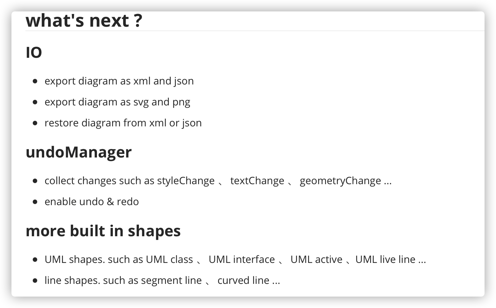
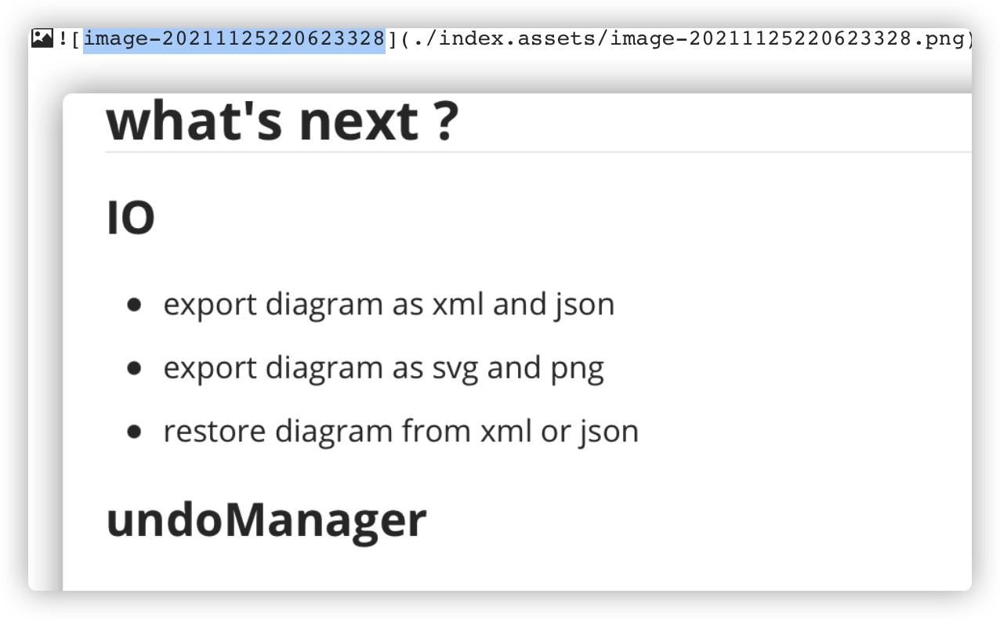

# Tutorial
## Essentials
### What is ez-diagram ?
ez-diagram is a powerful and easy javascript framework to help build rich graphs. for more examples , see [here](/demos.md)
### Installation
::: tip
ez-diagram is currently under development , you can checkout the source code from repo and build it . have fun !!!
:::
### Hello world
The following demo demonstrates how to use ez-diagram to create a simple graph with vertex and edge.

:::: tabs
::: tab preview
<a :href="$withBase('/examples/hello-world/hello-world.html')" target="_blank">open in new tab</a>
<iframe class="thin" :src="$withBase('/examples/hello-world/hello-world.html')"></iframe>
:::
::: tab code for es module env
<<< @/docs/.vuepress/public/examples/hello-world/hello-world.esm.js
:::
::: tab code for browser env
<<< @/docs/.vuepress/public/examples/hello-world/hello-world.umd.js
:::
::::


### Vertex and Edge
in this section we will talk about how to create  vertex or  edge to a graph.

ez-diagram provides many built in shapes to help you create different vertex .

:::: tabs
::: tab preview
<a :href="$withBase('/examples/add-vertex/add-vertex.html')" target="_blank">open in new tab</a>
<iframe class="thin" :src="$withBase('/examples/add-vertex/add-vertex.html')"></iframe>
:::
::: tab code for adding vertex
<<< @/docs/.vuepress/public/examples/add-vertex/add-vertex.esm.js
:::
::::

for more built in shapes , see <a :href="$withBase('/api-reference/modules.html#BUILTIN_SHAPE')" target="_blank">built in shapes</a>

also , you can create edge with class EzEdge.
:::: tabs
::: tab preview
<a :href="$withBase('/examples/add-edge/add-edge.html')" target="_blank">open in new tab</a>
<iframe class="thin" :src="$withBase('/examples/add-edge/add-edge.html')"></iframe>
:::
::: tab code for adding vertex
<<< @/docs/.vuepress/public/examples/add-edge/add-edge.esm.js
:::
::::

for more built in markers , see <a :href="$withBase('/api-reference/modules.html#BUILTIN_MARKER')" target="_blank">built in markers</a>

### Diagram actions

**diagram actions** provides a easy mechanism to modify current diagram. for example , you can simply execute
```javascript
 diagram.actions.execute(BUILTIN_ACTIONS.DELETE_SELECTED)
```
to delete the selected elements . for more built in actions , see 
<a :href="$withBase('/api-reference/modules.html#BUILTIN_MARKER')" target="_blank">built in actions</a>

if you want to chage default behavior of diagram action , you can simply overwrite corresponding action handler
```javascript
// overwrite delete action handler , only delete vertex , ignore edges
diagram.actions.register(BUILTIN_ACTIONS.DELETE_SELECTED, (diagram) => {
    let selected = diagram.pluginManager.getContext()?.selectedViewStates;
    if (!selected?.length) return false;

    selected = selected.filter((state) => state.node instanceof EzVertex);
    diagram.view.removeStates(selected);
    return true;
});
```

### Key handler
**key handler** enable use to handle keyboard events . ez-diagram provides serveral built in behavior for some keyboard event , such as
```
'Backspace' - delete selected elements
'ArrowDown' - move down selected elements
'ArrowUp' - move up selected elements
'ArrowLeft' - move left selected elements
'ArrowRight' - move right selected elements
```
you can use ``` diagram.keyHandler.bindKeyhandler ``` to overwrite or bind key handler , for example
```javascript
// overwrite exists key handler
diagram.keyHandler.bindKeyHandler(ModifierKey.none, "Backspace", () => {
    // implementation
});
// add a new handler when user press 'shift + d'
diagram.keyHandler.bindKeyHandler(ModifierKey.shift, "d", () => {
    // implementation
});

```

### styling diagram node
there are two way to style diagram nodes.
- by specify style options when creating vertex or edge
```js
  const vertex = new EzVertex(  
    new EzRectangle(0,0,10,10),
    { 
      /* style options here */
    },
    'vertex text'
  )
  const edge = new EzEdge(  
    [new EzPoint(0,0),new EzPoint(100,0)],
    { 
      /* style options here */
    }
  )
```
- by invoke <a :href="$withBase('/api-reference/classes/EzDiagram.html#setVertexStyle')">EzDiagram.setVertexStyle</a> or <a :href="$withBase('/api-reference/classes/EzDiagram.html#setEdgeStyle')">EzDiagram.setEdgeStyle</a>

- available style options  <a :href="$withBase('/api-reference/modules/Style.html')">here</a>


## Advanced

### plugin development
An ez-diagram plugin is a class with one or more life cycle hooks which enable you to hook into a diagram's lifecycle.
here are two small step to development your own ez-diagram plugin:
- write a class which extends the base <a :href="$withBase('api-reference/classes/Plugin.EzDiagramPlugin.html')">EzDiagramPlugin</a> class.
- register your plugin instance with a plugin name , by <a :href="$withBase('api-reference/classes/Plugin.EzDiagramPluginManager.html#use')">diagram.pluginManager.use</a>

#### A simple example
the following example will show you how to create a ClickLog plugin , that is , when user click any diagram node , the node id will be logged in the console.

:::: tabs

::: tab click-log.esm.js
<<< @/docs/.vuepress/public/examples/click-log/click-log.esm.js
:::

::: tab click-log.plugin.js
<<< @/docs/.vuepress/public/examples/click-log/click-log.plugin.js
:::

::: tab util.js
<<< @/docs/.vuepress/public/examples/util.js
:::

::: tab click-log.html
<<< @/docs/.vuepress/public/examples/click-log/click-log.html
:::

::: tab preview
<a :href="$withBase('/examples/click-log/click-log.html')" target="_blank">open in new tab</a>
<iframe class="thin" :src="$withBase('/examples/click-log/click-log.html')"></iframe>
:::
::::

### EzElement
before talking about custom shape , i'd like to introduce the <a :href="$withBase('/api-reference/classes/EzElement.html')">EzElement</a>, it's a tool to help create and manipulate DOM element easily. 
the following example shows how to create a svg rect using EzElement
```js
// the below code create a svg rect like this:
// <rect x="0" y="0" width="100" height="100" style="width:100px;"></rect>
EzElement.el('rect').attr({x:0,y:0,width:100,height:100}).style({width:'10px'})

// the below code create a svg "g" element and append a ellipse as it's child
//   <g>
//      <ellipse rx="10" ry="10" cx="10" cy="10"></ellipse>
//   </g>
EzElement.el('g').appendChild(EzElement.el('ellipse').attr({cx:10,cy:10,rx:10,ry:10}));
```

### Custom shape
::: tip
TODO
:::
### Custom arrow heads
::: tip
TODO
:::
### Layout
::: tip
TODO
:::
## what's next ?
### IO
- export diagram as xml and json 
- export diagram as svg and png
- restore diagram from xml or json
### undoManager
- collect changes such as styleChange 、 textChange 、 geometryChange ...
- enable undo & redo 

### more built in shapes
- UML shapes. such as UML class 、 UML interface 、 UML active 、UML live line ...
- line shapes. such as segment line 、 curved line ...




